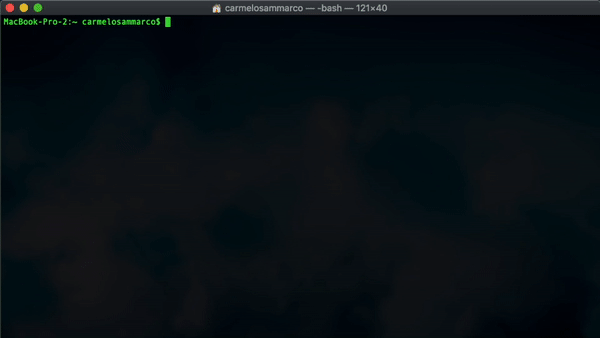

# ads4mo - Added Download Services for Mercator-Ocean

[](https://travis-ci.com/carmelosammarco/ads4mo) [](https://ci.appveyor.com/project/carmelosammarco/ads4mo) [](https://gitter.im/ads4mo/community?utm_source=badge&utm_medium=badge&utm_campaign=pr-badge) 


Python module containing added downloads services for download the netCDF files from the CMEMS's catalogue and especially usefull for big data requests. It is possible download data by MONTH, DEPTH or DAY until a maximum of three selected variables(Planning to increase this number thought).
It brings in a very intuitive scripting way what was already proposed with [MerOC](https://github.com/carmelosammarco/MerOC).

<p align="center">
  
</p>

## Be aware that:

The tool is in development so it can be possible find bugs, errors and imprecisions. Please to report them if you find one.

## Dependencies:

The dependencies required which are not installed by default are listed below:

- [x] motuclient>=1.8.1
- [x] ftputil>=3.4

## Installation and module usage

```
pip install ads4mo
```
we can import the module as:

```
from ads4mo import download
```
Once the module is imported we can call the interactive download process typing;

```
download()
```

At this point the system is going to ask;

- **Type of the download** which can be set typing one of the following:

     - **MONTH**: The entire period selected will be downloaded by months
     - **DEPTH**: The entire period selected will be downloaded by depth levels
     - **DAY**: The entire period selected will download as daily files
     - **MONTH&DEPTH**: The entire period selected will be downloaded by months and depth levels
     - **YEAR**: The entire period selected will be downloaded by years. Very usefull just when you want extract a grid point (The --longitude-min = --longitude-min and --latitude-min = --latitude-max). 

- **Starting/Ending Time**: If not values as HH:MM:SS are typed then the 12:00:00 is going to be used.

- **Motu client script** which is generated by the CMEMS web portal. 
Please to copy and paste just from the "--motu" until the end and don't forget to replace **USERNAME** and **PASSWORD** with your CMEMS credentials. You can leave untouched "--out-dir <OUTPUT_DIR> --out-name <OUTPUT_FILENAME>".

Following an example of the full script generted by the Web-portal:

```
python -m motuclient  --motu http://nrt.cmems-du.eu/motu-web/Motu --service-id GLOBAL_ANALYSIS_FORECAST_PHY_001_024-TDS --product-id global-analysis-forecast-phy-001-024 --longitude-min -180 --longitude-max 179.9166717529297 --latitude-min -80 --latitude-max 90 --date-min "2019-04-19 12:00:00" --date-max "2019-04-19 12:00:00" --depth-min 0.493 --depth-max 0.4942 --variable thetao --variable bottomT  --out-dir <OUTPUT_DIR> --out-name <OUTPUT_FILENAME> --user <USERNAME> --pwd <PASSWORD>
```

What you need to use as module's input:

```
--motu http://nrt.cmems-du.eu/motu-web/Motu --service-id GLOBAL_ANALYSIS_FORECAST_PHY_001_024-TDS --product-id global-analysis-forecast-phy-001-024 --longitude-min -180 --longitude-max 179.9166717529297 --latitude-min -80 --latitude-max 90 --date-min "2019-04-19 12:00:00" --date-max "2019-04-19 12:00:00" --depth-min 0.493 --depth-max 0.4942 --variable thetao --variable bottomT  --out-dir <OUTPUT_DIR> --out-name <OUTPUT_FILENAME> --user <USERNAME> --pwd <PASSWORD>
```